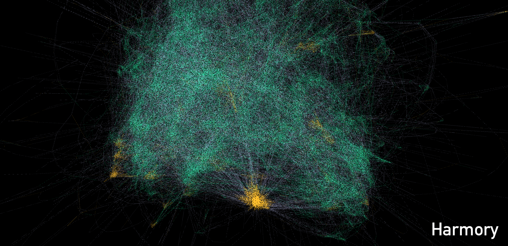

# Harmory: the Harmonic Memory
Harmory is a Knowledge Graph of interconnected harmonic patterns aimed to support creative applications in a fully transparent, accountable, and musically plausible way.

<p align="center">

</p>

## Harmory in a nutshell
We leverage the [Tonal Pitch Space](https://www.jstor.org/stable/40285402) - a cognitive model of Western tonal harmony to **project** chord progressions into a musically meaningful space. Then, we use novelty-based methods for structural analysis to **segment** chord sequences into meaningful harmonic structures. The latter are then compared with each other, across all progressions and via harmonic similarity, to reveal common/recurring **harmonic patterns**.

A KG is created to semantically establish relationships between patterns, based on: (i) *temporal links*, connecting two patterns if they are observed consecutively in the same progression; and (ii) *similarity links* among highly-similar patterns. By traversing the KG, and moving across patterns via temporal and similarity links, new progressions can be created in a combinational settings; but also, unexpected and surprising relationships can be found among pieces and composers of different genre, style, and historical period. This is also enabled by the scale and diversity of Harmory, which is built from [ChoCo](https://github.com/smashub/choco), the largest existing collection of harmonic annotations.

Currently, Harmory contains ~26K harmonic segments from 1800 harmonic (~10% of ChoCo, corresponding to all the audio partitions). Out of all segments: 13667 (16%) correspond to the same pattern families, 66175 (53%) are pattern-friendly (they share non-trivial similarities with other segments), whereas 8176 (32%) are inherently unique (they are found in other songs). More statistics are available at [this link](https://github.com/smashub/harmory/blob/main/harmory/analysis.ipynb).

## How to re-create Harmory

### Step 1: Environment setup
If you are using conda, you can now create a new virtual environment from a terminal session, by running the commands below.
```
conda create -n harmory python=3.9
conda activate harmory
```
Now that your environment is created and activated, you can install all required packages by running:
```
pip install -r requirements.txt
```
Your environment should now be ready to create Harmory.

### Step 2: Novelty-based harmonic segmentation
This step will perform harmonic segmentation on each track indexed in `choco_audio.txt` (a selection of ChoCo). The output of the segmentation will be written for each piece in a separate file in `data/structures/v1` in order to facilitate parallel access. Before running this command, please make sure to download a release of ChoCo (from [this link](https://github.com/smashub/choco/releases)), so that you can point to the corresponding JAMS folder (by replacing `../../choco/choco-jams/jams` with your local path).
```bash
python create.py segment ../../choco/choco-jams/jams \
    --selection ../data/samples/choco_audio.txt \
    --out_dir ../data/structures/v1 \
    --n_workers 6 --debug
```

### Step 3: Linking harmonic segments via similarity
You can now compute segment-wise similarities to discover harmonic patterns. This is done by running the command below, which will save three important objects: the `similarities.csv` file (containing an edge list of similarity links); an instance of `HarmonicPatternFinder`(to find similarities from given segments/patterns); and a `pattern2id` dictionary mapping pattern IDs to (ChoCo-alike) segment IDs. This provides full tractability of the music material in the memory. 

```bash
python create.py similarities ../data/structures/v1 \
    --out_dir ../data/similarities/v1 \
    --n_workers 6
```

### Step 4: Knowledge Graph creation

The Knowledge Graph is created from the data generated in [Step 2](#step-2--novelty-based-harmonic-segmentation) and [Step 3](#step-3--linking-harmonic-segments-via-similarity).
The generation of the KG consists of two main steps:
* **Instantiate Tracks**: tracks are instantiated and added to the knowledge graph, together with their metadata and segments;
* **Instantiate Similarity**: SegmentPatterns are instantiated and added to the knowledge graph and linked to the segments to which they refer to.

The creation of the KG is based on [RDFLib](https://rdflib.readthedocs.io/en/stable/), which allows the graph to be saved in the most common RDF serialisations.

```bash
python kg_create.py '../../data/structures/v1/' \
'../../data/similarities/v1/pattern2id.pkl' \
'../../data/similarities/similarities.csv' \
'../../data/knowledge-graph/v1/knowledge_graph.ttl' \
--serialization turtle \
--n_workers 6 --verbose
```

## Experiments
To validate Harmory, we carried out experiments to test the efficacy of the two central components underpinning its creation: the *harmonic similarity* method, and the *harmonic segmentation*. This section provides instructions to reproduce our experiments.

### Evaluating our harmonic similarity
Our method for harmonic similarity is compared to other state-of-the-art algorithms on the **cover song detection** 
task - a common benchmark for similarity algorithms in the symbolic music domain.

It is possible to compare performance in the cover song detection task using the following algorithms:
* **Dynamic Time Warping** (DTW) - a well-known algorithm for time series alignment;
* **TPSD** - a method based on the Tonal Pitch Space (TPS) model of Western tonal harmony;
* **SoftDTW** - a variant of DTW that allows for local warping of the time series;
* **LCSS** - a method based on the Longest Common Subsequence (LCS) algorithm.

It is possible to preprocess the chord data using two different variants of the _TPS_ distance:
* **Profile** - the TPS distance is computed between the chord and the local key of the piece;
* **Offset** - the TPS distance is computed between the chord and its preceding chord.

Moreover, the timeseries produced using both mode of the _TPS_ distance can be normalised both temporally and in terms 
of the values contained in the series.
Finally, you can test different constraint settings for the cover song detection task for the _DTW_, _SoftDTW_ and 
_LCSS_ algorithms, namely the **Sakoe Chiba** and the **Itakura** constraints.

For recreating the experiments, you can run the following command:

```bash
python cover_detection.py '../../exps/datasets/merge/' \
'../../exps/results/results.csv' 
```

You can also run different experiments by passing to the script the `--configuration` argument, which is composed by a 
list of tuples parameters comma-separated. Each tuple is consists of a sparate experiment, and it is composed by the 
following parameters:
`(<algorithm>, <tps_mode>, <temporal_normalisation>, <constraint>, <value_normalization>)`.

### Structural coverage of known patterns
Our harmonic segmentation, we measure the overlap between the resulting structures with a collection of well-known chordal patterns. This exemplifies the hypothesis that a good segmentation would maximise the "reuse" of harmonic patterns - as building blocks that can be found in other pieces.

First, we perform harmonic segmentation with our method (harmov) on a balanced sample of Harmory (`data/samples/medium-audio.txt`)

```bash
python create.py segment ../../choco/choco-jams/jams \
    --selection ../data/samples/mixed_audio_med.txt \
    --out_dir ../exps/segmentation/medium-audio/harmov/k%8__p%msaf__pml%24__psig%2 \
    --n_workers 6 --debug
```

We do the same using our baselines for time series segmentation: *fast low-cost unipotent semantic segmentation* (FLUSS), and a *static uniform split*. The commands below will run a grid search of the former methods, using the parameter space defined in `harmory/baselines.py`.
```bash
python baselines.py ../../choco/choco-jams/jams \
    --baselines fluss_segmentation \
    --selection ../data/samples/mixed_audio_med.txt \
    --out_dir ../exps/segmentation/medium-audio --n_workers 6

python baselines.py ../../choco/choco-jams/jams \
    --baselines uniform_split \
    --selection ../data/samples/mixed_audio_med.txt \
    --out_dir ../exps/segmentation/medium-audio --n_workers 6
```
Finally, we can evaluate the segmentations by computing the structural coverage of known harmonic patterns (which are stored in `data/known-patterns`). For this, we wrapped all commands in a single script.
```
bash segval.sh
```
Results will be saved in the given output folder as a CSV file, where each row contains the structural coverage of a segmentation method, using a specific parameter set, and with respect to all known harmonic patterns of a specific length (ranging from 4 to 10).


## Authors and attribution
[](https://doi.org/10.5281/zenodo.8021211)

```
@inproceedings{de2023harmonic,
  title={The Harmonic Memory: a Knowledge Graph of harmonic patterns as a trustworthy framework for computational creativity},
  author={de Berardinis, Jacopo and Mero{\~n}o-Pe{\~n}uela, Albert and Poltronieri, Andrea and Presutti, Valentina},
  booktitle={Proceedings of the ACM Web Conference 2023},
  pages={3873--3882},
  year={2023}
}
```

## Acknowledgments

We thank all the annotators for contributing to the project. This project is an output of [Polifonia](https://polifonia-project.eu), and has received funding from the European Union’s Horizon 2020 research and innovation programme under grant agreement No 101004746.

<a href="https://polifonia-project.eu"></a>

## License

The code in this repository is distributed under the MIT license. All data follows the dual licensing scheme of [ChoCo](https://github.com/smashub/choco), meaning that  CC-BY 4.0 is the reference license, unless data is derived from CASD, JAAH, and Mozart Piano Sonata (CC-BY-NC-SA).
